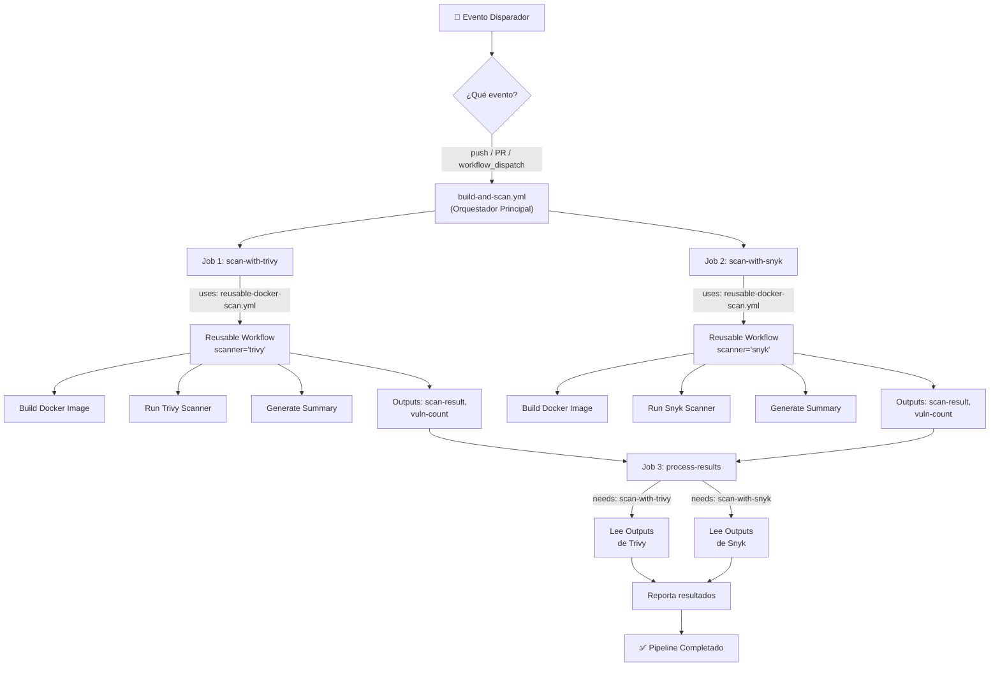
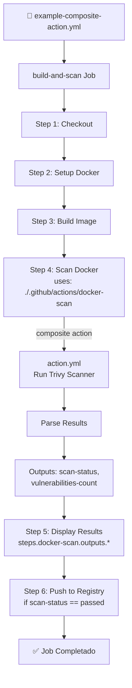

# Estructura de Workflows - Diagrama de Flujo

## 📊 Flujo General de Ejecución



---

## 🔀 Flujo Alternativo: Composite Action



---

## 📍 Comparativa: Quién Llama a Quién

### Opción 1: Reusable Workflow (Más Complejo)

```
build-and-scan.yml (DISPARADOR - nivel: workflow)
│
├─ Job: scan-with-trivy
│  └─ uses: ./.github/workflows/reusable-docker-scan.yml
│     │
│     └─ Job: scan (dentro del reusable)
│        ├─ Step: Checkout
│        ├─ Step: Build Docker
│        ├─ Step: Run Trivy (scanner='trivy')
│        ├─ Step: Generate Summary
│        └─ outputs: { result, vuln-count }
│
├─ Job: scan-with-snyk
│  └─ uses: ./.github/workflows/reusable-docker-scan.yml
│     │
│     └─ Job: scan (dentro del reusable)
│        ├─ Step: Checkout
│        ├─ Step: Build Docker
│        ├─ Step: Run Snyk (scanner='snyk')
│        ├─ Step: Generate Summary
│        └─ outputs: { result, vuln-count }
│
└─ Job: process-results
   ├─ needs: [scan-with-trivy, scan-with-snyk]
   ├─ Lee: needs.scan-with-trivy.outputs.*
   ├─ Lee: needs.scan-with-snyk.outputs.*
   └─ Step: Report Status
```

**Ventajas:**
- ✅ 2 jobs ejecutándose en paralelo = más rápido
- ✅ Resultados de cada scanner independientes
- ✅ Reutilizable en múltiples workflows

**Desventajas:**
- ❌ Más complejo de debuggear
- ❌ Consume más recursos (2 runners)

---

### Opción 2: Composite Action (Más Simple)

```
example-composite-action.yml (DISPARADOR - nivel: workflow)
│
└─ Job: build-and-scan
   ├─ Step 1: Checkout
   ├─ Step 2: Setup Docker Buildx
   ├─ Step 3: Build Image
   │
   ├─ Step 4: Scan Docker (id: docker-scan)
   │  └─ uses: ./.github/actions/docker-scan
   │     │
   │     └─ Composite Action (action.yml)
   │        ├─ Step: Run Trivy Scanner
   │        ├─ Step: Parse Results
   │        ├─ Step: Upload Artifact
   │        └─ outputs: { scan-status, vulnerabilities-count }
   │
   ├─ Step 5: Display Results
   │  └─ steps.docker-scan.outputs.scan-status
   │
   └─ Step 6: Push to Registry (if passed)
```

**Ventajas:**
- ✅ Todo en un mismo job = un runner
- ✅ Más fácil de debuggear
- ✅ Steps secuenciales

**Desventajas:**
- ❌ Solo un scanner por ejecución
- ❌ Más lento que paralelo

---

## 🔗 Mapa de Archivos

```
.github/
│
├── workflows/
│   ├── build-and-scan.yml
│   │   ├─ DISPARA: push, PR, workflow_dispatch
│   │   ├─ LLAMA A: reusable-docker-scan.yml (2 veces)
│   │   └─ ORQUESTA: process-results job
│   │
│   ├── reusable-docker-scan.yml
│   │   ├─ TIPO: Workflow Reutilizable (workflow_call)
│   │   ├─ RECIBE: image-name, image-tag, severity, scanner
│   │   ├─ ENVÍA: scan-result, vulnerabilities-found
│   │   └─ EJECUTA: Trivy o Snyk según input
│   │
│   └── example-composite-action.yml
│       ├─ DISPARA: push, PR, workflow_dispatch
│       └─ LLAMA A: ./.github/actions/docker-scan (1 vez)
│
└── actions/
    └── docker-scan/
        ├── action.yml
        │   ├─ TIPO: Composite Action
        │   ├─ RECIBE: image-name, image-tag, severity, fail-build
        │   ├─ ENVÍA: vulnerabilities-count, scan-status
        │   └─ EJECUTA: Trivy scan + parsing
        │
        └── (Se llama a nivel de STEPS)
```

---

## 🎯 Cuándo Usar Cada Uno

### Usa Reusable Workflow Si:
- ✅ Necesitas ejecutar múltiples jobs en paralelo
- ✅ Diferentes scanners simultáneamente
- ✅ Lógica compleja con múltiples steps
- ✅ Compartir en múltiples workflows

### Usa Composite Action Si:
- ✅ Solo necesitas encapsular unos pocos steps
- ✅ Ejecutar en un único job
- ✅ Acceso directo a variables del job
- ✅ Reutilizable dentro del mismo workflow

---

## 📊 Matriz de Comunicación

| Desde | Hacia | Tipo | Sintaxis | Outputs |
|------|------|------|---------|---------|
| `build-and-scan.yml` | `reusable-docker-scan.yml` | Workflow → Workflow | `uses: ./.github/workflows/...` | `needs.job.outputs.*` |
| `example-composite-action.yml` | `docker-scan/action.yml` | Step → Step | `uses: ./.github/actions/...` | `steps.id.outputs.*` |

---

## 🔄 Ciclo Completo: build-and-scan.yml

**Tiempo aprox: 5-10 minutos**

```
⏱️ T+0s   ├─ Evento: push/PR/dispatch
⏱️ T+5s   ├─ scan-with-trivy inicia
⏱️ T+5s   ├─ scan-with-snyk inicia (paralelo)
⏱️ T+30s  ├─ scan-with-trivy: Build + Trivy completa
⏱️ T+45s  ├─ scan-with-snyk: Build + Snyk completa
⏱️ T+50s  ├─ process-results inicia (after both jobs)
⏱️ T+52s  └─ ✅ Todo completo
```

**Sin paralelismo:** sería T+95s (séquencial)

---

## 💡 Ejemplo de Salida

### Trivy Job (89 vulnerabilidades)
```
✅ No vulnerabilities found → FALSE
⚠️  Found 89 vulnerabilities
```

### Snyk Job (0 vulnerabilidades)
```
✅ Scan completed
```

### Process-Results Job
```
Trivy scan result: vulnerabilities-found
Trivy vulnerabilities: 89

Snyk scan result: completed
Snyk vulnerabilities: 0

⚠️  Vulnerabilities found but build continues.
    Please review security reports in the artifacts.
```

---

## 🚀 Cómo Ejecutar Cada Uno

### Opción 1: Reusable Workflow
```bash
# Automático (push/PR)
git push

# Manual
gh workflow run build-and-scan.yml
```

### Opción 2: Composite Action
```bash
# Automático (push/PR)
git push

# Manual
gh workflow run example-composite-action.yml
```

---

## 📝 Notas

1. **Reusable Workflow** = Mejor para CI/CD complejos
2. **Composite Action** = Mejor para acciones específicas reutilizables
3. Ambos pueden combinarse en un mismo repo
4. Los outputs permiten orquestar jobs dependientes
